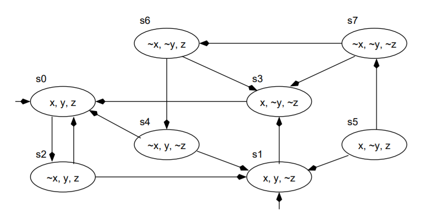
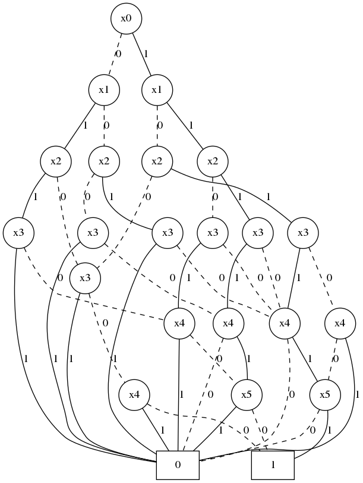

# Đồ án: Xây dựng công cụ cho phép biểu diễn đồ thị lớn và rút trích đồ thị con

## 1. Thông tin học viên

- Nguyễn Bảo Long (22C11065)
- Lê Nhựt Nam (22C11067)

## 2. Các lớp trong thư viện

### 2.1. Các lớp trừu tượng

- Lớp đỉnh trừu tượng: `ABCNode`

  ```py
  class ABCNode:
      def __init__(self, label:Optional[int]=None, data Optional[object]=None) -> None:
          self.data = data
          self.label = label
          self.list_neighbor:list[int] = [] # Các nhãn cho các láng giềng của node.
          self.list_edge:list[ABCEdge] = [] # Các cạnh kề với node.
  ```

- Lớp cạnh trừu tượng: `ABCEdge`

  ```py
  class ABCEdge:
      def __init__(self, label: Optional[int] = None, data: Optional[object]=None) -> None:
          self.label = label # Nhãn cạnh.
          self.data = data # Dữ liệu mà cạnh chứa.
  ```

- Lớp đồ thị trừu tượng: `ABCGraph`

  ```py
  class ABCGraph:
      def __init__(self) -> None:
          self.list_node: dict[int, ABCNode] = {} # Danh sách từ điển các node
          self.num_node = 0 # Số lượng node
          self.num_edge = 0 # Số lượng cạnh
          self.is_directed:bool = False # Mặc định là đồ thị vô hướng
  ```

### 2.1. Các lớp dẫn xuất

- Lớp đồ thị vô hướng: `UDBGraph`

  ```py
  class UDBGraph(ABCGraph):
      def __init__(self, data_path: Optional[str] = None) -> None:
          ABCGraph.__init__(self)
  ```

- Lớp cạnh của đồ thị có hướng: `DEdge`

  ```py
  class DEdge(ABCEdge):
      def __init__(self, direction: str, label: Optional[int] = None, data: Optional[object] = None) -> None:
          super().__init__(label, data)
          if direction in {'in', 'out'}:
              self.direction: str = direction
          else:
              raise KeyError('Node\'s construction fails.')
  ```

- Lớp đỉnh của đồ thị có hướng: `DNode`

  ```py
  class DNode(ABCNode):
      def __init__(self, label: Optional[int] = None, data: Optional[object] = None) -> None:
          super().__init__(label, data)
          self.list_edge: list[DEdge] = []
  ```

- Lớp đồ thị có hướng: `DBGraph`

  ```py
  class DBGraph(ABCGraph):
      def __init__(self) -> None:
          super().__init__()
          self.list_node: dict[int, DNode] = {}
          self.is_directed = True
  ```

- Nhận xét: Việc thiết kế các lớp như trên giúp tối đa hóa việc kế thừa các phương thức cơ bản của đồ thị như **thêm node, xóa node, xóa cạnh** vào đồ thị. Từ đó, giúp giảm bớt quá trình viết code.

## 3. Các phương thức trên đồ thị

### 3.1. Các phương thức chung

- Các phương thức này được cài đặt trong file `Graph.py`. Cả đồ thị có hướng và đồ thị vô hướng đề có thể sử dụng.

- Thêm node vào đồ thị: hàm `add_node`

  ```py
  def add_node(self, node: ABCNode) -> Union[None, ValueError]:
      """Mô tả: Thêm một nút vào đồ thị (vào danh sách node của đồ thị). Nếu node chưa có nhãn, phát sinh nhãn dựa trên số nút hiện có.
      - Tham số:
          - node (kiểu dữ liệu ABCNode).
      - Trả về:
          - Trả về None nếu thêm thành công
          - Raise ValueError nếu node đã tồn tại trong đồ thị
      """
  ```

- Xóa nút khỏi đồ thị: `remove_node`

  ```py
  def remove_node(self, node: int) -> Union[None, KeyError]:
      """Mô tả: Xóa node khỏi đồ thị. Nếu đồ thị vô hướng, chỉ cần viếng thăm tất cả lân cận và xóa đi liên kết trước khi loại bỏ nó từ danh sách node của đồ thị. Đối với đồ thị có hướng :D???
      Tham số:
      - node (int): nhãn của node.
      Trả về: None nếu thành công hoặc raise KeyError nếu thất bại.
      """
  ```

- Xóa cạnh khỏi đồ thị: `remove_edge`
  ```py
  def remove_edge(self, start_node: int, end_node: int, edge_label: Optional[int] = None) -> Union[None, KeyError]:
      """Mô tả: Loại bỏ một cạnh có đỉnh lần lượt là start_node và end_node. Đối với đồ thị vô hướng, ta loại bỏ đỉnh lân cận và cạnh liên kết cho từng đỉnh start_node và end_node. Đối với đồ thị có hướng, ta :D??
      - Tham số:
          - start_node (int): nhãn của đỉnh bắt đầu cạnh.
          - end_node (int): nhãn của đỉnh kết thúc cạnh.
      - Trả về:
          - Trả về None nếu thành công
          - Raise KeyError nếu node không tồn tại trong đồ thị.
      """
  ```

### 3.2. Các thao tác dẫn xuất

- Thêm cạnh vào đồ thị: `add_edge`

  ```py
  @abstract.abstractmethod
  def add_edge(self, node1: int, node2: int, edge: Optional[ABCEdge] = None) -> Union[None, KeyError]:
      """Mô tả: Thêm một cạnh giữa 2 nút node1 và node2. Phương pháp này sẽ thực thi khác nhau trong đồ thị có hướng và vô hướng.
      - Tham số:
          - node1: nhãn của đỉnh thứ nhất;
          - node2: nhãn của đỉnh thứ hai;
          - edge: nhãn của cạnh nếu có
      - Trả về:
          - Trả về None nếu thành công
          - Raise KeyError nếu một trong số các node không tồn tại trong đồ thị
      """
  ```

- Tính bậc của một node: `get_degree`

  ```py
  @abstract.abstractmethod
  def get_degree(self, node: int) -> Union[int, KeyError]:
      """Mô tả: Tính toán bậc của một nút cho trước. Đối với đồ thị vô hướng, bậc của node = bậc ngoài = bậc trong. Đối với đồ thị có hướng, bậc của node = bậc ngoài + bậc trong.
      - Tham số:
          - node (int): nhãn của node.
      - Trả về:
          - Số bậc (int) nếu thành công
          - Raise KeyError nếu node không tồn tại trong đồ thị.
      """
  ```

## 4. Các thao tác khác trên đồ thị

- Phát sinh đồ thị ngẫu nhiên:

  ```py
  def random_graph(n, p, *, directed=False, saved=True, folder_path='gdata') -> [list, int, int]:
      """Mô tả: Hàm phát sinh đồ thị
      - Tham số:
          - n (int): Khởi tạo đồ thị với số đỉnh là n và không có cạnh nào.
          - p (float/ double): một ngưỡng để quyết định có thêm cạnh hay không?
          - directed (bool, optional): Quyết định liệu đồ thị có hướng hay vô hướng?
      - Thuật toán: Với mỗi (không có thứ tự/ có thứ tự) cặp nút (u,v):
          - Phát sinh một số thực ngẫu nhiên trong khoảng từ [0, 1]
          - Nếu số này nhỏ hơn p, thêm cạnh (u-v) vào đồ thị.
      - Trả về: Danh sách kề, số lượng nút, số lượng cạnh.
      """
  ```

- Rút trích đồ thị con

  - Phương pháp dựa trên các node cho trước: `load_subgraph`

    ```py
    def load_subgraph(list_label:list[int], data_path:str):
        """Mô tả: Rút trích đồ thị con dựa trên một danh sách node cho trước

        - Tham số:
            - list_label (list[int]): danh sách nhãn của các node
            - data_path (str): đường dẫn đến file dữ liệu đồ thị (sẽ nói kỹ ở phần Cấu trúc tệp tin)

        - Raises:
            - FileNotFoundError: Raise nếu file dữ liệu đồ thị không tồn tại
            - KeyError: Raise nếu cấu trúc file bị sai định dạng

        - Trả về:
            - [UDBGraph, DBGraph]: Trả về đối tượng đồ thị có hướng hoặc vô hướng
        """
    ```

  - Phương pháp dựa trên các cạnh cho trước: Quy về bài toán dựa trên các node cho trước.

## 5. Cấu trúc dữ liệu đồ thị

### 5.1. Hệ thống tệp tin lưu trữ

- Dữ liệu đồ thị được lưu trữ bằng hai tập tin chính:
  - `vertices_lst`: Tệp tin lưu trữ danh sách đỉnh và dữ liệu của từng đỉnh.
  ```
  D # Dòng đầu tiên cho biết đồ thị có phải đồ thị có hướng, nếu có là D, không là U
  0:data of node 1 # Các dòng tiếp theo <nhãn đỉnh: dữ liệu đỉnh>, dòng thứ i chứa thông tin của nút có nhãn i-2
  1:data of node 2
  ```
  - `adj_lst`: Tệp tin lưu trữ danh sách kề, bao gồm thông tin thể hiện kết nối giữa 2 đỉnh và cách mà chúng kết nối với nhau (dữ liệu cạnh).
  ```
  0:0(0-data of edge 0),2(1-data of edge 1) # Các dòng có dạng: <nhãn đỉnh: Danh sách(nhãn đỉnh(nhãn cạnh-dữ liệu cạnh)), dòng thứ i lưu trữ danh sách kề của nút có nhãn i - 1
  1:0(2-data of edge 2),5(3-data of edge 3)
  ```

### 5.2. Thao tác với đồ thị trên tệp tin

- Đọc dữ liệu từ file: Sử dụng hàm `read_graph_from_file`

  ```py
  def read_graph_from_file(data_path:str) -> Union[DBGraph, UDBGraph, FileNotFoundError, None]:
      """Đọc dữ liệu hệ thống tập tin. Do giả định đồ thị lớn, hàm thực thi đọc từng dòng mà không tải hết lên ram.
      - Tham số:
          - file_name (str): Dường dẫn đến thư mục chứa dữ liệu.
      - Trả về:
          - Trường hợp dữ liệu đồ thị vô hướng: Trả về cấu trúc dữ liệu UDBGraph
          - Trường hợp dữ liệu đồ thị có hướng: Trả về cấu trúc dữ liệu DBGraph
          - Raise FileNotFoundError nếu không tìm thấy tệp tin.
      """
  ```

- Lưu dữ liệu xuống file: Sử dụng hàm `save_graph`

  ```py
  def save_graph(lst_nodes: dict, is_directed: bool, data_path: str = None) -> Union[None, FileNotFoundError]:
      """Lưu trữ đồ thị
      - Tham số:
          - lst_nodes (dict): Danh sách nút
          - is_directed (bool): Đồ thị có hướng hay vô hướng
          - data_path (str, optional): Đường dẫn đến thư mục cần lưu. Defaults to None.
      - Trả về:
          - Trả về None nếu thành công.
          - Raise FileNotFoundError nếu không tìm thấy tệp tin.
      """
  ```

## 6. MỞ RỘNG: Tìm hiểu cấu trúc biểu diễn đồ thị lớn (CHƠI ĐÙA với Binary Decision Diagram)

Đồ thị lớn có thể chiếm nhiều bộ nhớ. Chúng ta có thể sử dụng Sơ đồ quyết định nhị phân (Binary Decision Diagram) để giảm độ phức tạp của không gian. Trước tiên, chúng tôi sẽ chuyển đổi biểu đồ thành công thức boolean, sau đó chuyển đổi công thức đó thành Sơ đồ quyết định nhị phân (bản thân nó là một đồ thị).

Để chuyển đổi biểu đồ này thành công thức boolean, trước tiên chúng ta cần biểu diễn từng biến dưới dạng tổ hợp các biến nhị phân. Nếu như đồ thị có n nút, chúng ta sẽ cần có log_2(n) biến nhị phân.

Ví dụ:

| Nút nguồn | x_1 | x_2 | x_3 |
| --------- | --- | --- | --- |
| n1        | 0   | 0   | 0   |
| n2        | 0   | 0   | 1   |
| n3        | 0   | 1   | 0   |
| n5        | 0   | 1   | 1   |
| n5        | 1   | 0   | 0   |
| n6        | 1   | 0   | 1   |
| n7        | 1   | 1   | 0   |
| n8        | 1   | 1   | 1   |



Biểu thức luận lý cho nút n1 là (not) x_1 and (not) x_2 and (not) x_3, biểu thức luận lý cho nút n3 là (not) x_1 and x_2 and (not) x_3, thì cạnh n1-n3 có dạng E_13 = [(not) x_1 and (not) x_2 and (not) x_3] and [(not) x_1 and x_2 and (not) x_3]. Từ biểu thức cách cạnh, ta lập được biểu thứ E = E_01 or E_13 or ... cho đồ thị.

Sử dụng biểu thức này cho việc xử lý thành một dạng tinh gọn hơn nhờ BDD. Bằng cách duyệt BDD cho ta biết được những cạnh gì có trong đồ thị. Một đường đi dừng ở 1 có nghĩa là cạnh đó nằm trong đồ thị gốc, ngược là giá trị cho ra là 0.


