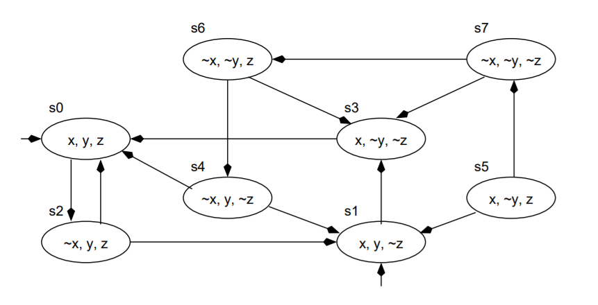
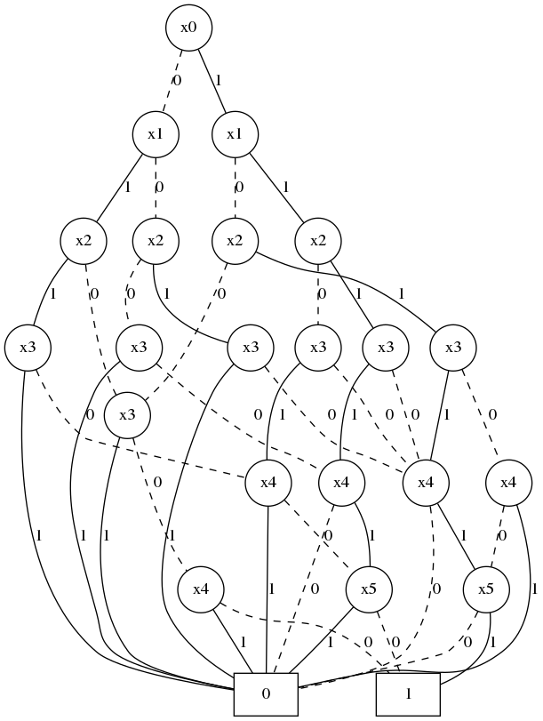

# Đồ án: Xây dựng công cụ cho phép biểu diễn đồ thị lớn và rút trích đồ thị con

Học viên:
- Nguyễn Bảo Long (22C11065)
- Lê Nhựt Nam (22C11067)

## 1. Thiết kế cấu trúc lưu trữ/ Hệ thống tập tin/ Nhập xuất

**1.1/ Hệ thống tập tin lưu trữ**

Dữ liệu đồ thị được lưu trữ bằng hai tập tin chính:
- vertices_lst: Danh sách đỉnh
```
# File: vertices_lst
D # Dòng đầu tiên cho biết đồ thị có phải đồ thị có hướng, nếu có là D, không là U
0:6 # Các dòng tiếp theo <nhãn đỉnh: dữ liệu đỉnh>, dòng thứ i chứa thông tin của nút có nhãn i-2
```
- adj_lst: Danh sách kế
```
# File: adj_lst
0:0(0-3),2(1-3),4(2-3),5(3-3),7(4-3) # Các dòng có dạng: <nhãn đỉnh: Danh sách(nhãn đỉnh(nhãn cạnh-dữ liệu cạnh)), dòng thứ i lưu trữ danh sách kề của nút có nhãn i - 1
```

**1.2/ Hệ thống nhập xuất, lưu trữ đồ thị**

Đọc dữ liệu từ file: đọc theo cấu trúc đã đề xuất như ở trên.

```py
def read_graph_from_file(data_path:str) -> Union[DBGraph, UDBGraph, FileNotFoundError, None]:
"""Đọc dữ liệu hệ thống tập tin. Do giả định đồ thị lớn, hàm thực thi đọc từng dòng mà không tải hết lên ram.
Tham số:
- file_name (str): Dường dẫn đến thư mục chứa dữ liệu.
Trả về:
- Trường hợp dữ liệu đồ thị vô hướng: Trả về cấu trúc dữ liệu UDBGraph
- Trường hợp dữ liệu đồ thị có hướng: Trả về cấu trúc dữ liệu DBGraph
- Nếu có lỗi xảy ra, dữ liệu bị lỗi, raise FileNotFoundError
"""
```

Lưu dữ liệu xuống file: lưu theo cấu trúc đã đề xuất như ở trên.

```py
def save_graph(lst_nodes: dict, is_directed: bool, data_path: str = None) -> Union[None, FileNotFoundError]:
"""Lưu trữ đồ thị
Tham số:
- lst_nodes (dict): Danh sách nút
- is_directed (bool): Đồ thị có hướng hay vô hướng
- data_path (str, optional): Đường dẫn đến thư mục cần lưu. Defaults to None.
Trả về:
- Trả về None nếu thành công.
- Raise FileNotFoundError, Nếu có lỗi xảy ra, dữ liệu hoặc đường dẫn bị lỗi.
"""
```

## 2. Thiết kế cấu trúc dữ liệu

**2.1/ Cấu trúc dữ liệu ABCNode**

```py
class ABCNode:

    def __init__(self, label:Optional[int]=None, data Optional[object]=None) -> None:
        self.data = data
        self.label = label
        self.list_neighbor:list[int] = [] # Các nhãn cho các láng giềng của node.
        self.list_edge:list[ABCEdge] = [] # Các cạnh kề với node.
```

**2.2/ Cấu trúc dữ liệu ABCEdge**

```py
class ABCEdge:
    def __init__(self, label: Optional[int] = None, data: Optional[object]=None) -> None:
        self.label = label # Nhãn cạnh.
        self.data = data # Dữ liệu mà cạnh chứa.
```

**2.3/ Cấu trúc dữ liệu đồ thị tổng quát**

Cấu trúc dữ liệu

```py
class ABCGraph:
    def __init__(self) -> None:
        self.list_node: dict[int, ABCNode] = {} # Danh sách từ điển các node
        self.num_node = 0 # Số lượng node
        self.num_edge = 0 # Số lượng cạnh
        self.is_directed:bool = False # Nếu False, đồ thị vô hướng. Ngược lại, đồ thị có hướng
```

Các phương thức:

**2.3.a) Thêm nút vào đồ thị**

```py
def add_node(self, node: ABCNode) -> Union[None, ValueError]:
"""Mô tả: Thêm một nút vào đồ thị (vào danh sách node của đồ thị). Nếu node chưa có nhãn, phát sinh nhãn dựa trên số nút hiện có.
Tham số:
- node (kiểu dữ liệu ABCNode).
Trả về: trả về None nếu thêm thành công. Nếu không raise ValueError.
"""
```

**2.3.b) Thêm cạnh vào đồ thị**


```py
@abstract.abstractmethod
def add_edge(self, node1: int, node2: int, edge: Optional[ABCEdge] = None) -> Union[None, KeyError]:
"""Mô tả: Thêm một cạnh giữa 2 nút node1 và node2. Phương pháp này sẽ thực thi khác nhau trong đồ thị có hướng và vô hướng.
Tham số:
- node1: nhãn của đỉnh thứ nhất;
- node2: nhãn của đỉnh thứ hai;
- edge: nhãn của cạnh nếu có
Trả về: None nếu thành công hoặc raise KeyError nếu thất bại.
"""
```

**2.3.c) Xóa nút khỏi đồ thị**

```py
def remove_node(self, node: int) -> Union[None, KeyError]:
"""Mô tả: Xóa node khỏi đồ thị. Nếu đồ thị vô hướng, chỉ cần viếng thăm tất cả lân cận và xóa đi liên kết trước khi loại bỏ nó từ danh sách node của đồ thị. Đối với đồ thị có hướng :D???
Tham số:
- node (int): nhãn của node.
Trả về: None nếu thành công hoặc raise KeyError nếu thất bại.
"""
```

**2.3.d) Xóa cạnh khỏi đồ thị**

```py
def remove_edge(self, start_node: int, end_node: int) -> Union[None, KeyError]:
"""Mô tả: Loại bỏ một cạnh có đỉnh lần lượt là start_node và end_node. Đối với đồ thị vô hướng, ta loại bỏ đỉnh lân cận và cạnh liên kết cho từng đỉnh start_node và end_node. Đối với đồ thị có hướng, ta :D??
Tham số:
- start_node (int): nhãn của đỉnh bắt đầu cạnh.
- end_node (int): nhãn của đỉnh kết thúc cạnh.
Trả về: None nếu thành công hoặc raise KeyError nếu thất bại.
"""
```

**2.3.e) Tính bậc của nút cho trước**

```py
@abstract.abstractmethod
def get_degree(self, node: int) -> Union[int, KeyError]:
"""Mô tả: Tính toán bậc của một nút cho trước. Đối với đồ thị vô hướng, bậc của node = bậc ngoài = bậc trong. Đối với đồ thị có hướng, bậc của node = bậc ngoài + bậc trong.
Tham số:
- node (int): nhãn của node.
Trả về: số bậc (int) nếu thành công hoặc raise KeyError nếu thất bại.
"""
```

**2.3.f) Xóa tất cả các cạnh**

```py
def remove_all_edges(self, node1: int, node2: int) -> Union[None, KeyError]:
"""Mô tả: Xóa tất cả các cạnh giữa hai nút cho cho trước
Tham số:
- node1 (int): Nhãn của nút đầu vào thứ nhất.
- node2 (int): Nhãn của nút đầu vào thứ hai.
Trả về:
- None nếu thành công, ngược lại raise exception KeyError.
"""
```

**2.4/ Cấu trúc dữ liệu đồ thị vô hướng (Kế thừa từ cấu trúc dữ liệu đồ thị tổng quát)**

Dựa trên cơ sở của lớp đồ thị tổng quát và thực hiện cài đặt lại các phương thức sao cho phù hợp.

```py
class UDBGraph(ABCGraph):
    def __init__(self, data_path: Optional[str] = None) -> None:
        ABCGraph.__init__(self)
```

**2.5/ Cấu trúc dữ liệu đồ thị có hướng (Kế thừa từ cấu trúc dữ liệu đồ thị tổng quát)**

Cấu trúc dữ liệu cạnh có hướng:

```py
class DEdge(ABCEdge):
    def __init__(self, direction: str, label: Optional[int] = None, data: Optional[object] = None) -> None:
        super().__init__(label, data)
        if direction in {'in', 'out'}:
            self.direction: str = direction
        else:
            raise KeyError('Node\'s construction fails.')
```

Cấu trúc dữ liệu nút có hướng:
```py
class DNode(ABCNode):
    def __init__(self, label: Optional[int] = None, data: Optional[object] = None) -> None:
        super().__init__(label, data)
        self.list_edge: list[DEdge] = []
```

Cấu trúc dữ liệu dồ thị có hướng:

```py
class DBGraph(ABCGraph):
    def __init__(self) -> None:
        super().__init__()
        self.list_node: dict[int, DNode] = {}
        self.is_directed = True
```


**2.6/ Phát sinh đồ thị ngẫu nhiên (có hướng/ vô hướng)**

```py
def random_graph(n, p, *, directed=False, saved=True, folder_path='gdata') -> [list, int, int]:
"""Mô tả: Hàm phát sinh đồ thị
Tham số:
- n (int): Khởi tạo đồ thị với số đỉnh là n và không có cạnh nào.
- p (float/ double): một ngưỡng để quyết định có thêm cạnh hay không?
- directed (bool, optional): Quyết định liệu đồ thị có hướng hay vô hướng?
Thuật toán:
    Với mỗi (không có thứ tự/ có thứ tự) cặp nút (u,v):
        - Phát sinh một số thực ngẫu nhiên trong khoảng từ [0, 1]
        - Nếu số này nhỏ hơn p, thêm cạnh (u-v) vào đồ thị.
Trả về: Danh sách kề, số lượng nút, số lượng cạnh.
"""
```

**2.7/ Rút trích dồ thị con**

**2.7.a) Nodes induced subgraph**

```py
def node_induced_subgraph(self, induced_lst_nodes: list[int]) -> Union[bool, ResourceWarning]:
""" Một đồ thị con dựa trên các nút khởi điểm (A node-induced subgraph) là một đồ thị có các cạnh mà các điểm cuối của chúng đều nằm trong tập hợp nút đã chỉ định.
Tham số:
- induced_lst_nodes (list[int]): Các nút để tạo thành đồ thị con. Liệt kê nhãn số nguyên.
Trả về: một đồ thị con được tạo ra trên các nút đã cho. Hoặc raise ResourceWarning
"""
```

**2.7.b) Edges induced subgraph**

```py
def edges_induced_subgraph(self, induced_lst_edges: list[int]) -> Union[bool, ResourceWarning]:
""" Một đồ thị con dựa trên các cạnh khởi điểm (A edge-induced subgraph) tương đương với việc tạo một đồ thị mới sử dụng các cạnh đã cho.
Tham số:
- induced_lst_edges (list[int]): Các cạnh để tạo thành đồ thị con. Liệt kê nhãn số nguyên.
Trả về: một đồ thị con được tạo ra trên các cạnh đã cho. Hoặc raise ResourceWarning
"""
```

**2.8/ MỞ RỘNG: Tìm hiểu cấu trúc biểu diễn đồ thị lớn (CHƠI ĐÙA với Binary Decision Diagram)**

Đồ thị lớn có thể chiếm nhiều bộ nhớ. Chúng ta có thể sử dụng Sơ đồ quyết định nhị phân (Binary Decision Diagram) để giảm độ phức tạp của không gian. Trước tiên, chúng tôi sẽ chuyển đổi biểu đồ thành công thức boolean, sau đó chuyển đổi công thức đó thành Sơ đồ quyết định nhị phân (bản thân nó là một đồ thị).

Để chuyển đổi biểu đồ này thành công thức boolean, trước tiên chúng ta cần biểu diễn từng biến dưới dạng tổ hợp các biến nhị phân. Nếu như đồ thị có n nút, chúng ta sẽ cần có log_2(n) biến nhị phân.

Ví dụ:

| Nút nguồn  | x_1  | x_2  | x_3  |
|---|---|---|---|
| n1  | 0  | 0  | 0  |
| n2  | 0  | 0  | 1  |
| n3  | 0  | 1  | 0  |
| n5  | 0  | 1  | 1  |
| n5  | 1  | 0  | 0  |
| n6  | 1  | 0  | 1  |
| n7  | 1  | 1  | 0  |
| n8  | 1  | 1  | 1  |

{ width=50% }

Biểu thức luận lý cho nút n1 là (not) x_1 and (not) x_2 and (not) x_3, biểu thức luận lý cho nút n3 là (not) x_1 and x_2 and (not) x_3, thì cạnh n1-n3 có dạng E_13 = [(not) x_1 and (not) x_2 and (not) x_3] and [(not) x_1 and x_2 and (not) x_3]. Từ biểu thức cách cạnh, ta lập được biểu thứ E = E_01 or E_13 or ... cho đồ thị.

Sử dụng biểu thức này cho việc xử lý thành một dạng tinh gọn hơn nhờ BDD. Bằng cách duyệt BDD cho ta biết được những cạnh gì có trong đồ thị. Một đường đi dừng ở 1 có nghĩa là cạnh đó nằm trong đồ thị gốc, ngược là giá trị cho ra là 0.

